# Map Depot for ATAK — User Guide

**Version 0.5 · takwerx**

**Download Map Depot 0.5** (pick the one matching your ATAK-CIV version, sideload, then load it in ATAK's Plugins manager):

- **ATAK-CIV 5.6:** https://github.com/takwerx/map-depot/releases/download/v0.5/ATAK-Plugin-MapDepot-0.5--5.6.0-civ-release.apk
- **ATAK-CIV 5.7:** https://github.com/takwerx/map-depot/releases/download/v0.5/ATAK-Plugin-MapDepot-0.5--5.7.0-civ-release.apk
- **ATAK-CIV 5.8:** https://github.com/takwerx/map-depot/releases/download/v0.5/ATAK-Plugin-MapDepot-0.5--5.8.0-civ-release.apk

All releases: https://github.com/takwerx/map-depot/releases

Map Depot downloads map data from inside ATAK. Without it, getting a new base map
or a terrain file onto a device means a web browser, the Downloads folder and the
Import Manager — awkward on a phone, worse in the field. Map Depot puts the
catalog in the plugin, and installs what you pick into the folder ATAK already
scans.

---

## Before you start

Published builds exist for **ATAK-CIV 5.6, 5.7 and 5.8**. Plugins are matched to
the ATAK release they were built against, so download the one for the ATAK
version on your device — a mismatch will not load, and the failure does not look
like a version problem.

Map Depot needs outbound HTTPS (port 443) and nothing else. No account, no key,
no configuration, and no TAK server involvement.

---

## 1. Opening it

Load the plugin from ATAK's Plugins manager, then open it from the toolbar.

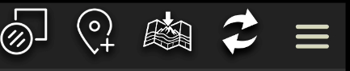

The landing page offers four kinds of data, each on its own page.

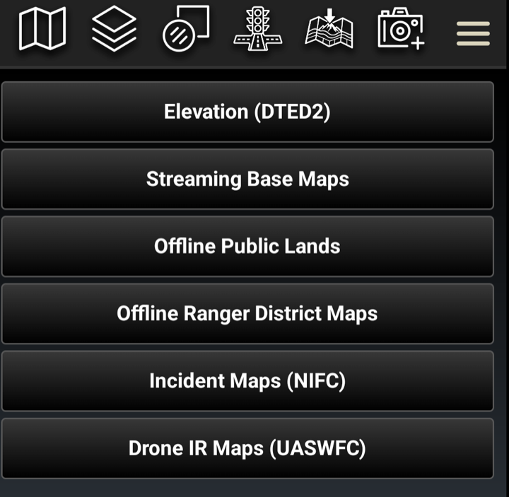

- **Elevation (DTED2)** — terrain, by state or province. What viewsheds and
  elevation readouts need.
- **Streaming Base Maps** — imagery and street maps served over the network,
  including transparent overlays.
- **Offline Public Lands** — Forest Service vector basemaps, one per national
  forest or grassland, held on the device.
- **Offline Ranger District Maps** — the printed district maps, as GeoPDFs.

---

## 2. How every page works

A list of what is available, a **Get** button on each row, and a line at the top
saying what is happening. Rows report one of three states, so the list doubles as
an inventory of what the device already holds.

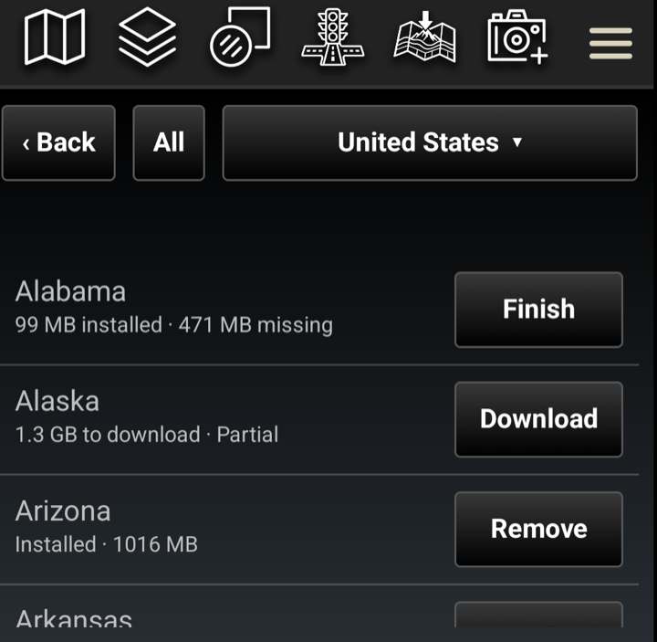

- **Get** — none of it is on the device.
- **Finish** — some of it is. Only the missing part downloads.
- **Remove** — all of it is here.

Downloads resume rather than restart after a dropped connection, and can be
cancelled at any point. Whatever had already arrived is kept, and **Finish**
picks it up from there.

---

## 3. Elevation

Elevation is DTED level 2, by state and province, and shared between neighbors:
it comes in one-degree squares, and a square covering one state usually covers
part of the next. The depot stores each square once, so a second state near the
first is much smaller than its own size suggests.

The country button switches between the United States and Canada.

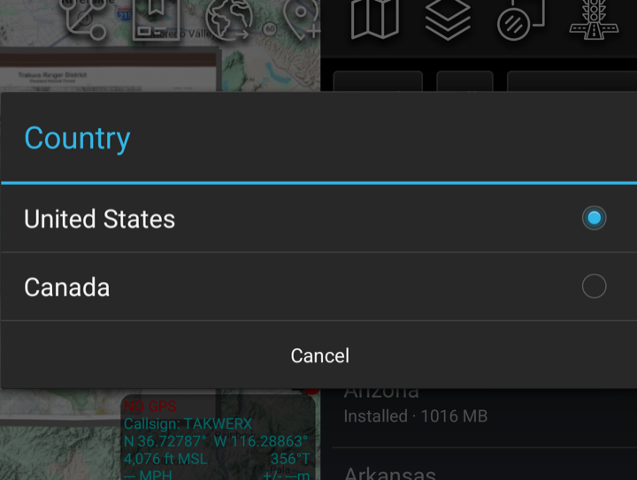

Confirming quotes what **this** device still needs, not the region's full size,
and says how much it will skip.

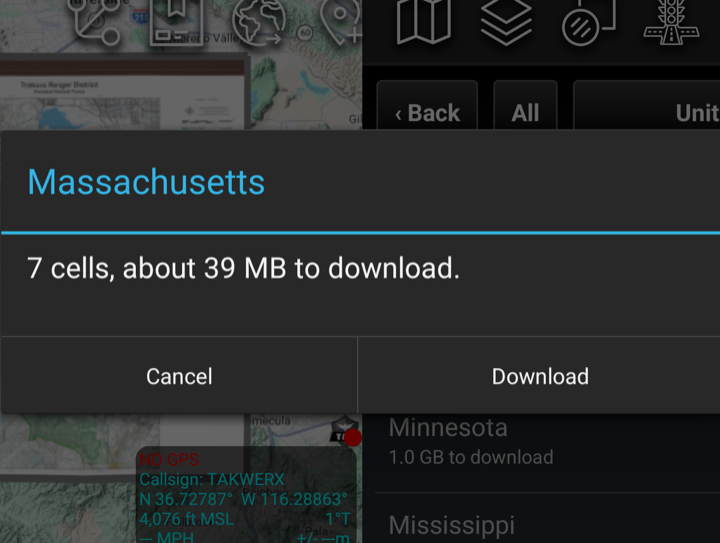

While a region downloads, its row carries a progress bar and a percentage, and
the line above counts cells and megabytes. **Cancel download** sits above the
list, full width.

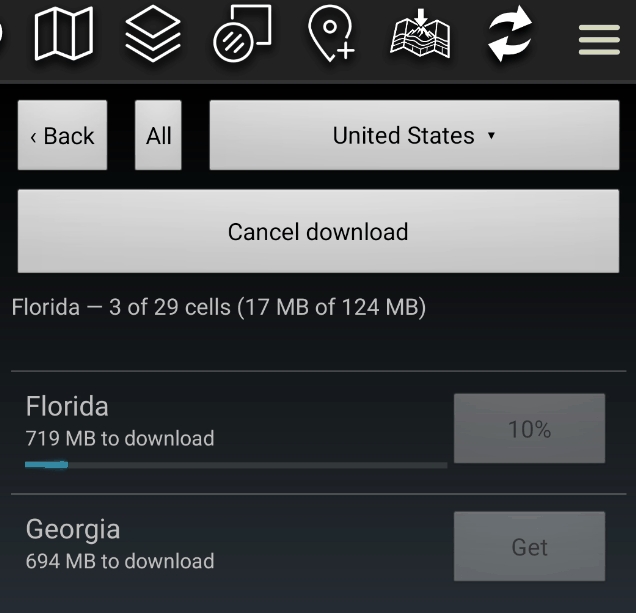

Cancelling keeps every cell that had already finished: the row becomes
**Finish**, and picking it up later downloads only what is left. Other rows wait
while one is downloading — one region at a time.

---

## 4. Streaming base maps

Map sources served over the network rather than stored on the device: satellite
imagery, street maps, nautical charts, topographic sheets. Installing one adds it
to ATAK's map source list; ATAK fetches tiles as you pan and caches what it has
drawn.

The category button narrows a long list.

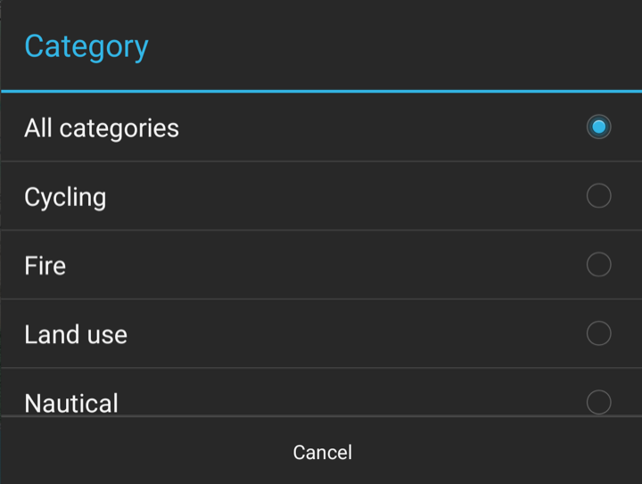

Each row says who serves the map and how far it can be zoomed. **Zoom 21** is
close enough to see parking spaces; **zoom 10** is regional only.

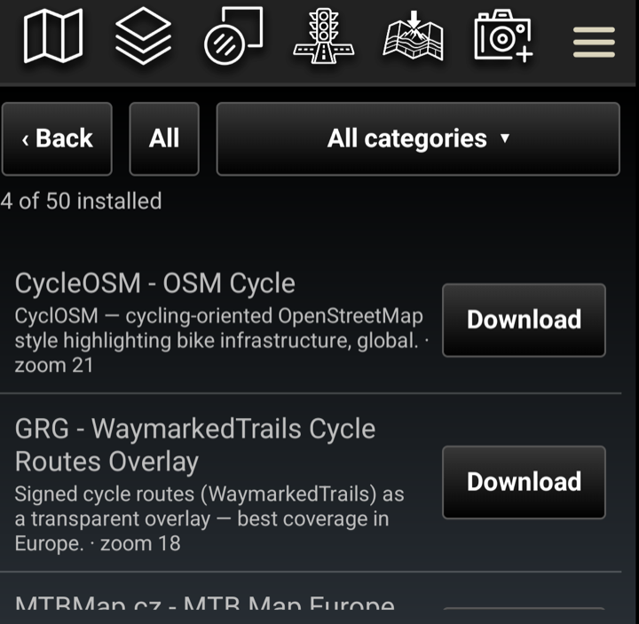

### Overlays

Some sources are *overlays* rather than base maps: roads, labels and points of
interest on a transparent background, drawn over whatever is underneath.

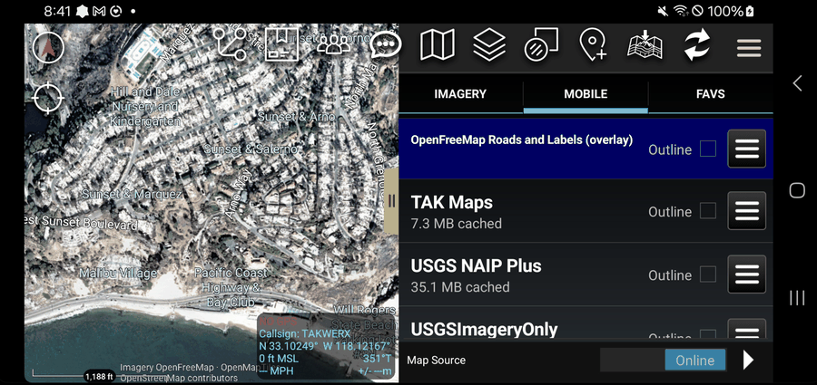

This is what makes fresh imagery usable. Aerial imagery flown after an event has
no street names on it. An overlay puts them back without hiding the imagery.

---

## 5. Offline public lands

A Forest Service vector basemap for each national forest and grassland — roads,
trails, boundaries, contours and labels — held on the device and drawn with no
network at all. These are large: tens of megabytes for a grassland, over a
gigabyte for the biggest forests.

Type part of a forest's name to narrow the list.

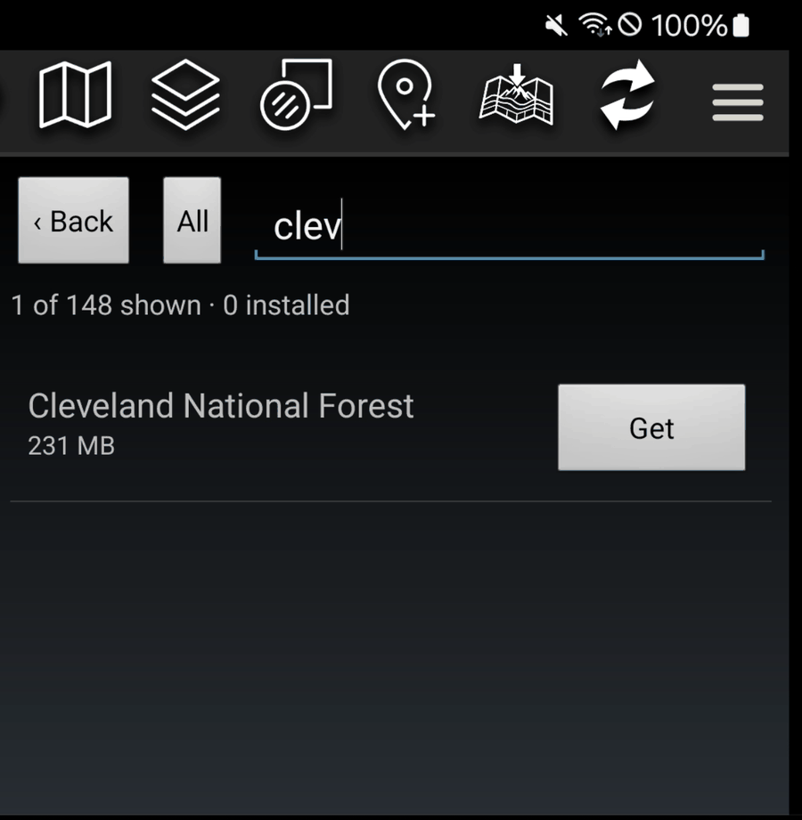

Downloads report progress and can be cancelled.

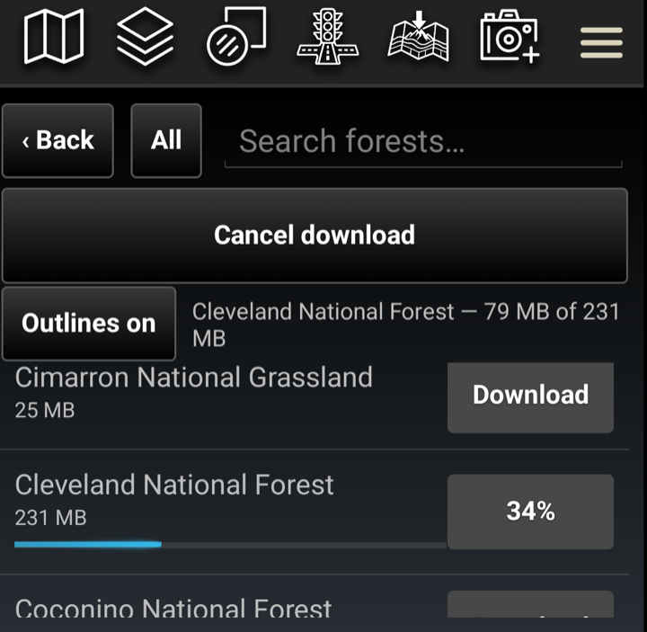

Once installed it is a map source like any other — forest road numbers, trail
names and boundaries, all local. Being vector rather than imagery it stays sharp
at any zoom, and takes far less space than the equivalent tiles would.

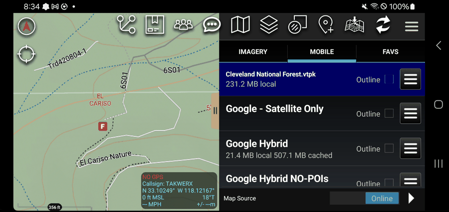

---

## 6. Offline ranger district maps

The printed ranger district maps, as GeoPDFs. Where a forest basemap is the whole
forest at map scale, a district map is the sheet a district office hands out,
with its margin, legend and printed detail.

Search by forest name to see its districts. Each row names the forest and state
it belongs to.

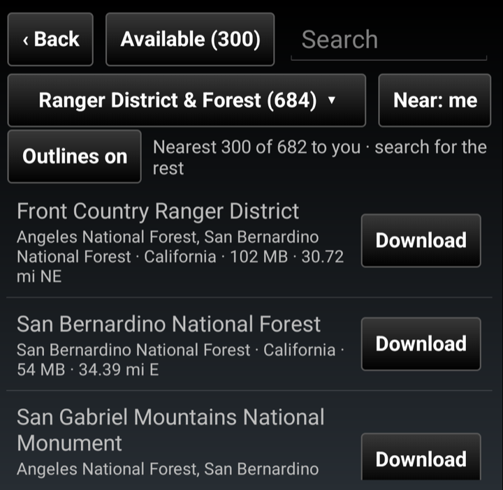

Installed, a district map lands as a georeferenced overlay, in the right place on
the ground, over whatever base map is showing.

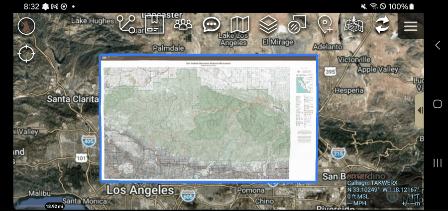

---

## 7. Finding what you already have

Every page has a filter button, next to **Back**, that cycles **All** →
**Installed** → **Available**. Set to **Installed**, the page becomes a list of
what is on this device.

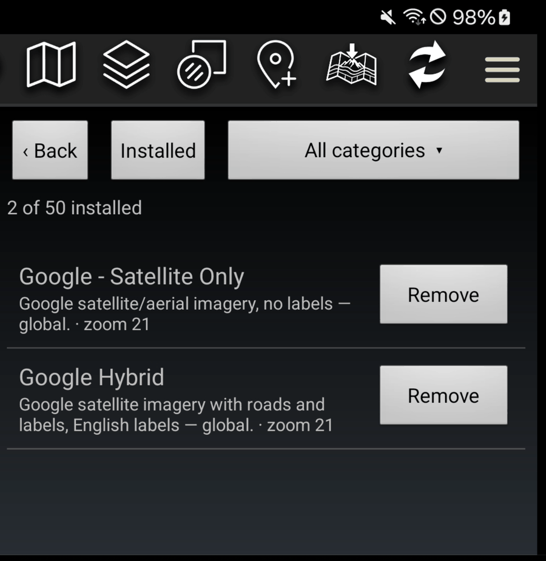

An installed offline map says **tap to go there**, in green. Tapping the row
turns that map on and takes you to it.

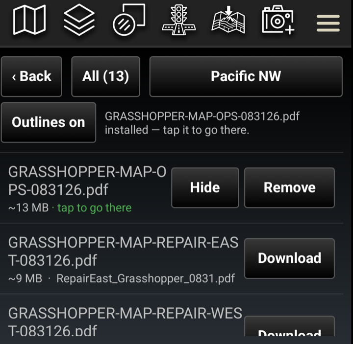

Straight after a download it may say it is still being added to the map list —
ATAK is indexing the file, which takes a while for a large one. It goes there on
its own when that finishes. Nothing needs tapping again.

---

## 8. Removing

**Remove** appears on anything installed, and says what removing actually frees
before it does it.

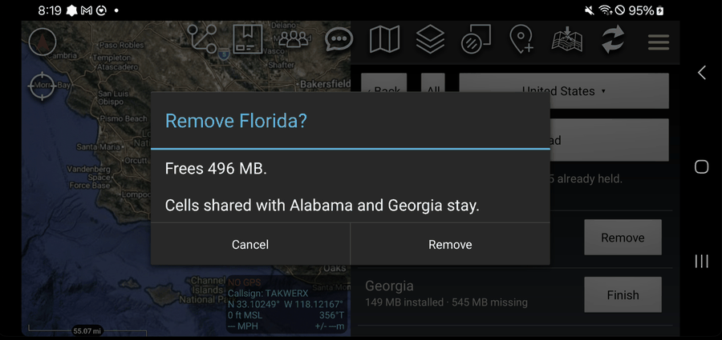

For elevation that is rarely the region's full size. Squares shared with a
neighboring region you also hold are kept, because that region still needs them,
and the dialog names which neighbors those are.

A small state wedged between larger ones may share **all** its squares. Rather
than run a removal that frees nothing, Map Depot says so, and names what else
would have to go for the space to come back.

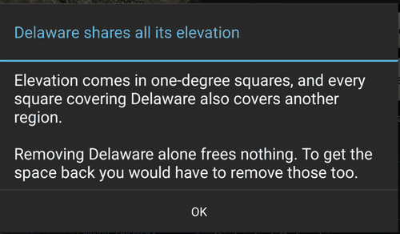

---

## 9. Where files go

Map Depot writes into ATAK's own folders, so what it installs is
indistinguishable from data put there by hand.

| Data | Folder |
|---|---|
| Elevation | `atak/DTED/`, one file per one-degree square |
| Streaming base maps | `atak/imagery/`, as map source files |
| Offline public lands | `atak/imagery/`, as vector tile packages |
| Ranger district maps | `atak/grg/`, as georeferenced PDFs |

Installed maps appear in ATAK's own layer list alongside anything else you have.

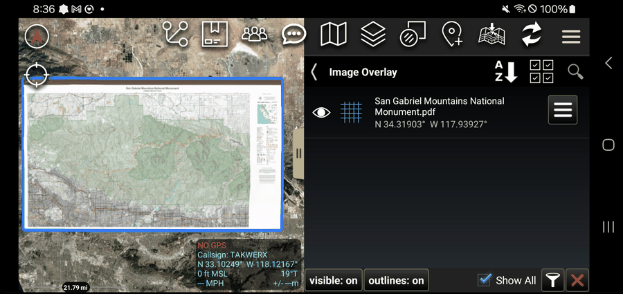

Removing something through Map Depot tells ATAK first and deletes the file after,
so no layer is left pointing at something that is gone.

---

## 10. In the plugin

The same guide ships inside the plugin as a PDF, for when you are in the field
without this page. In ATAK go to **Settings → Tool Preferences → Map Depot →
Plugin Documentation**.

---

## Questions and problems

Issues and questions: https://github.com/takwerx/map-depot/issues
