# Map Depot for ATAK — User Guide

**Version 1.5 · takwerx**

**Download Map Depot 1.5** (pick the one matching your ATAK-CIV version, sideload, then load it in ATAK's Plugins manager):

- **ATAK-CIV 5.6:** https://github.com/takwerx/map-depot/releases/download/v1.5/ATAK-Plugin-MapDepot-1.5--5.6.0-civ-release.apk
- **ATAK-CIV 5.7:** https://github.com/takwerx/map-depot/releases/download/v1.5/ATAK-Plugin-MapDepot-1.5--5.7.0-civ-release.apk
- **ATAK-CIV 5.8:** https://github.com/takwerx/map-depot/releases/download/v1.5/ATAK-Plugin-MapDepot-1.5--5.8.0-civ-release.apk

All releases: https://github.com/takwerx/map-depot/releases

Map Depot downloads map data from inside ATAK. Without it, getting a new base map
or a terrain file onto a device means a web browser, the Downloads folder and the
Import Manager — awkward on a phone, worse in the field. Map Depot puts the
catalog in the plugin, and installs what you pick into the folder ATAK already
scans.

---

## Before you start

Published builds exist for **ATAK-CIV 5.6, 5.7 and 5.8**. Plugins are matched to
the ATAK release they were built against, so download the one for the ATAK
version on your device — a mismatch will not load, and the failure does not look
like a version problem.

Map Depot needs outbound HTTPS (port 443) and nothing else. No account, no key,
no configuration, and no TAK server involvement.

**On ATAK 5.6, Offline Public Lands does not work.** Vector tile package support
arrived in ATAK 5.7, so on 5.6 a forest basemap would download and then be
invisible to ATAK. Map Depot marks those maps as needing 5.7 or newer rather
than letting you spend a gigabyte on one. Elevation, streaming base maps and
Forest Service map sheets all work normally on 5.6.

**On official ATAK 5.8.0.4, Offline Public Lands is not available either.** ATAK
5.8.0.4 does not start with a vector tile package on the phone once it has
cataloged it — it dies before any plugin loads, with no message. Map Depot dims
the section and says so, and does not offer the downloads. If you already have
packages, Map Depot asks once, shortly after ATAK starts, whether to move them to
`atak/imagery.off`, where ATAK does not look. Take it: otherwise ATAK will not
open after its next restart, and the recovery is to move the files out with a
file manager. Move them back by hand when tak.gov ships a fixed ATAK. Elevation,
streaming base maps, Forest Service map sheets and the incident maps all work
normally on 5.8.

---

## 1. Opening it

Load the plugin from ATAK's Plugins manager, then open it from the toolbar.


The landing page offers six kinds of data, each on its own page.


- **Elevation (DTED2)** — terrain, by state or province. What viewsheds and
  elevation readouts need.
- **Streaming Base Maps** — imagery and street maps served over the network,
  including transparent overlays.
- **Offline Public Lands** — Forest Service vector basemaps, one per national
  forest or grassland, held on the device.
- **Offline Forest Service Maps** — the printed map sheets, as GeoPDFs: ranger
  district, forest, regional, 100K and FSTopo.
- **Incident Maps (NIFC)** — the operational maps posted for a going fire: ops,
  division, air operations, transport, briefing and IR.
- **Drone IR Maps (UASWFC)** — infrared flown by uncrewed aircraft, as
  georeferenced PDFs and KMZs.

---

## 2. How every page works

A list of what is available, a **Download** button on each row, and a line at the
top saying what is happening. Rows report one of three states, so the list
doubles as an inventory of what the device already holds.


- **Download** — none of it is on the device.
- **Finish** — some of it is. Only the missing part downloads.
- **Remove** — all of it is here.

Downloads resume rather than restart after a dropped connection, and can be
cancelled at any point. Whatever had already arrived is kept, and **Finish**
picks it up from there.

---

## 3. Elevation

Elevation is DTED level 2, by state and province, and shared between neighbors:
it comes in one-degree squares, and a square covering one state usually covers
part of the next. The depot stores each square once, so a second state near the
first is much smaller than its own size suggests.

The country button switches between the United States and Canada.


Confirming quotes what **this** device still needs, not the region's full size,
and says how much it will skip.


While a region downloads, its row carries a progress bar and a percentage, and
the line above counts cells and megabytes. **Cancel download** sits above the
list, full width.


Cancelling keeps every cell that had already finished: the row becomes
**Finish**, and picking it up later downloads only what is left. Other rows wait
while one is downloading — one region at a time.

---

## 4. Streaming base maps

Map sources served over the network rather than stored on the device: satellite
imagery, street maps, nautical charts, topographic sheets. Installing one adds it
to ATAK's map source list; ATAK fetches tiles as you pan and caches what it has
drawn.

The category button narrows a long list.


Each row says who serves the map and how far it can be zoomed. **Zoom 21** is
close enough to see parking spaces; **zoom 10** is regional only.


### Overlays

Some sources are *overlays* rather than base maps: roads, labels and points of
interest on a transparent background, drawn over whatever is underneath.


This is what makes fresh imagery usable. Aerial imagery flown after an event has
no street names on it. An overlay puts them back without hiding the imagery.

---

## 5. Offline public lands

A Forest Service vector basemap for each national forest and grassland — roads,
trails, boundaries, contours and labels — held on the device and drawn with no
network at all. These are large: tens of megabytes for a grassland, over a
gigabyte for the biggest forests.

**Needs ATAK 5.7 or newer, and not official 5.8.0.4.** On 5.6 these rows are
disabled and say so. On official 5.8.0.4 they are disabled too, because ATAK
does not start with one of these installed; see "Before you start".

Type part of a forest's name to narrow the list.


Downloads report progress and can be cancelled.


Once installed it is a map source like any other — forest road numbers, trail
names and boundaries, all local. Being vector rather than imagery it stays sharp
at any zoom, and takes far less space than the equivalent tiles would.


---

## 6. Offline Forest Service maps

The Forest Service's printed map sheets, as GeoPDFs. Where a forest basemap is
the whole forest at map scale, a sheet is what an office hands out, with its
margin, legend and printed detail. Four series, picked with the button beside
Back; each entry shows how many sheets it holds:

- **Ranger District & Forest** — the district maps and the whole-forest visitor
  maps. Search by forest name to see its districts. Each row names the forest
  and state it belongs to.
- **Regional** — one map per Forest Service region, in two editions: with ranger
  district boundaries, or with forest boundaries. Eighteen sheets.
- **100K** — the 1:100,000 series, nationwide, forest land or not. About 1,800
  sheets of 12 to 46 MB.
- **FSTopo 24K** — the 1:24,000 quads. About 18,000 sheets of 3 to 4 MB. The
  list is fetched the first time you choose it, then kept on the device.

The 100K and FSTopo lists are sorted by distance from the center of the map,
nearest first, and every row says how far and in which direction. Pan the map
to where you are working, open the list, and the sheet you want is at the top.
Only the nearest 300 are listed, and the status line says so; move the map or
type part of a quad or state name to reach the rest. The distance is in the
units your ATAK is set to.


Installed, a sheet lands as a georeferenced overlay, in the right place on the
ground, over whatever base map is showing.

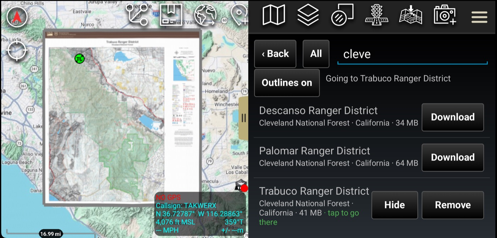

---

## 7. Incident maps

Two archives the incident community publishes to. Where every other page is a
catalog that changes with a release, these change hourly: what is on the page is
what the fire's GIS shop uploaded this morning.

- **Incident Maps (NIFC)** — `ftp.wildfire.gov`. Ops, division, air operations,
  transport, briefing and IR products, for fires across the country.
- **Drone IR Maps (UASWFC)** — `uaswfc.org`. Infrared flown by uncrewed
  aircraft.

Both are public and need no account.

### Picking your area

Pick your geographic area once and it is remembered. It is a button, not a buried
setting, so you can change it when the next fire is somewhere else.

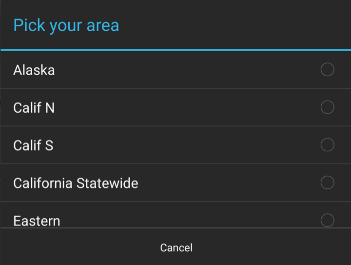

From there you walk down to your fire and into whatever folder that shop uses.
They do not all agree — one fire has `DAILY MAP PRODUCT`, `GIS` and `IR`, another
has `Current`, `Products` and `QR` — so the plugin shows what is actually there
rather than a fixed set of screens.

Folders named by date are listed **newest first**, because the map you want is
almost always today's.

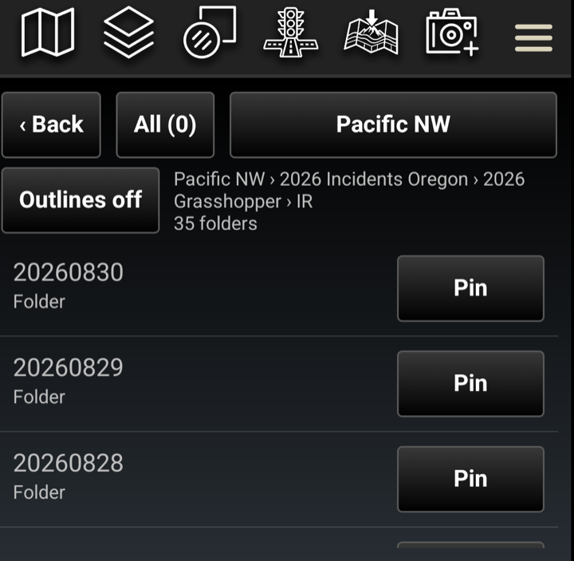

### Names you can read

The archives name files for a GIS shop's file browser. Map Depot renames them for
a phone:

```
ops_arch_e_port_20260828_0115_RoweCreekComplex_ORPRD000491_0828day.pdf
  →  OR-PRD-ROWE-CREEK-COMPLEX-MAP-OPS-082826.pdf
```

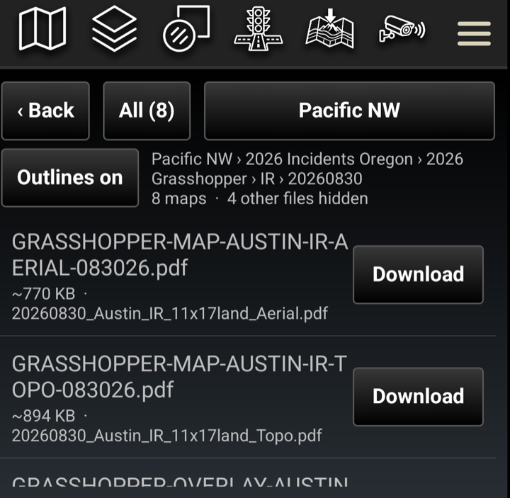

The date is the **operational period** — the shift the map is for, not the moment
it came off the plotter. Division letters, sortie numbers and IR areas are all
kept, because two maps you can both pick have to be able to sit on the device
together. The original name is shown underneath, so a map named over the radio
can still be found.

A PDF says **MAP** and installs as a georeferenced overlay. A KMZ says
**OVERLAY** and installs as ATAK's own kind of overlay. The name tells you which
you are about to get.

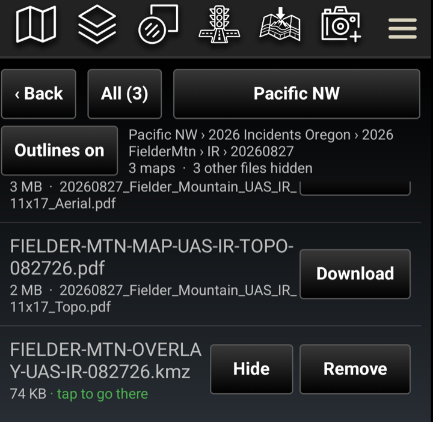

Only maps are offered: PDFs and KMZs. Geodatabases, shapefile bundles and flight
logs are left out — a flight log is a PDF, but it is a sortie's paperwork rather
than a map, and one filed as a GRG would drape a flat page over your map. The
line under the buttons says how many were hidden, so a short list is never
mistaken for an empty folder.

### Pinning the fire you are working

A crew assigned to a fire opens the same folder twenty times a day, and reaching
it means a region, a year folder, the fire and then a product folder.

Every folder has a **Pin** button.

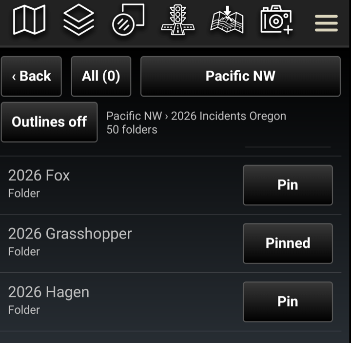

It then sits at the top of the first screen, in cyan, one tap away. **Remove** on
a pinned row unpins it and deletes nothing.

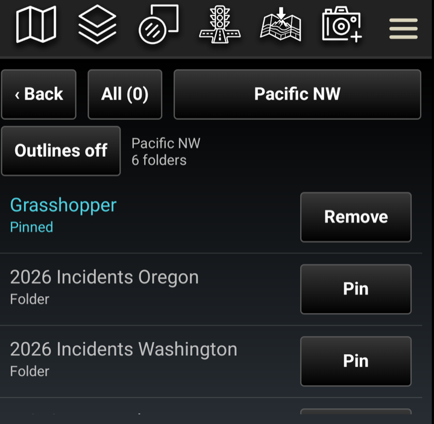

Anything can be pinned, not only a fire: if you live in one product folder, pin
that and you land straight in it. Pins survive a restart and a plugin update, and
the two archives keep their own.

### On the map

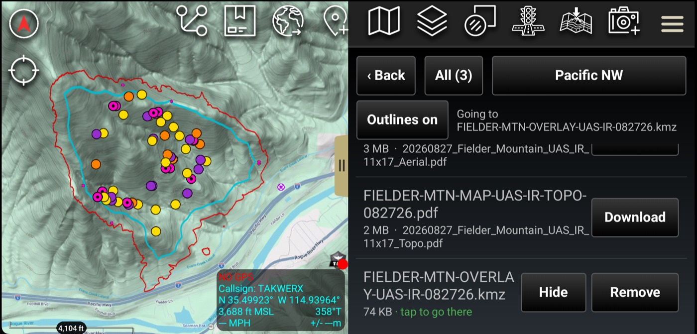

**Outlines** turns the footprints of every GRG on or off, which is how you see
what covers the ground in front of you before deciding what to turn on.

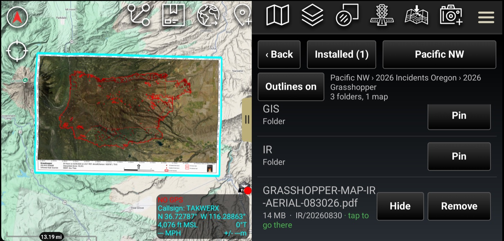

---

## 8. Finding what you already have

Every page has a filter button, next to **Back**, that cycles **All** →
**Installed** → **Available**. Set to **Installed**, the page becomes a list of
what is on this device.


An installed offline map says **tap to go there**, in green. Tapping the row
turns that map on and takes you to it.


Straight after a download it may say it is still being added to the map list —
ATAK is indexing the file, which takes a while for a large one. It goes there on
its own when that finishes. Nothing needs tapping again.

Set to **Available**, the page hides everything you already hold, which is the
view you want when you are adding to a device rather than checking it.

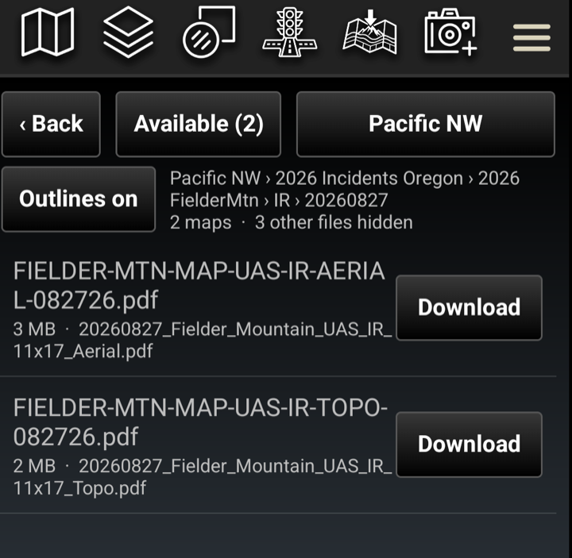

When a filter is hiding everything, the page says so rather than reading as an
empty folder — "3 maps here, hidden by the Installed filter" is a different
problem from a folder with nothing in it.

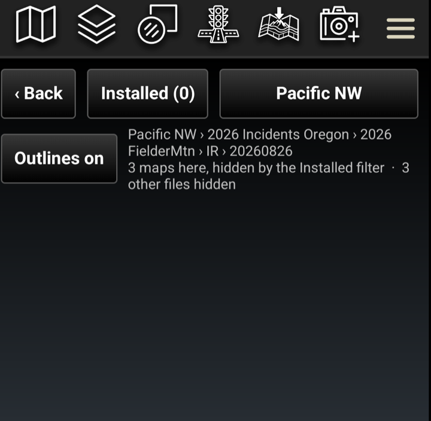

### Show and Hide

An installed overlay or GRG carries a **Show** or **Hide** button beside
**Remove**. It does what the Overlay Manager's checkbox does, without leaving the
plugin — useful when you hold a dozen maps of the same fire and want one of them
on at a time.

---

## 9. Removing

**Remove** appears on anything installed, and says what removing actually frees
before it does it.


For elevation that is rarely the region's full size. Squares shared with a
neighboring region you also hold are kept, because that region still needs them,
and the dialog names which neighbors those are.

A small state wedged between larger ones may share **all** its squares. Rather
than run a removal that frees nothing, Map Depot says so, and names what else
would have to go for the space to come back.


**Remove** on a pinned folder is a different thing: it unpins the folder and
deletes nothing. A pin is a shortcut, not a download.

---

## 10. Where files go

Map Depot writes into ATAK's own folders, so what it installs is
indistinguishable from data put there by hand.

| Data | Folder |
|---|---|
| Elevation | `atak/DTED/`, one file per one-degree square |
| Streaming base maps | `atak/imagery/`, as map source files |
| Offline public lands | `atak/imagery/`, as vector tile packages |
| Forest Service map sheets | `atak/grg/`, as georeferenced PDFs |
| Incident and drone maps (PDF) | `atak/grg/`, as georeferenced PDFs |
| Incident and drone maps (KMZ) | `atak/overlays/`, as ATAK overlays |

Installed maps appear in ATAK's own layer list alongside anything else you have.


Removing something through Map Depot tells ATAK first and deletes the file after,
so no layer is left pointing at something that is gone.

---

## 11. In the plugin

The same guide ships inside the plugin as a PDF, for when you are in the field
without this page. In ATAK go to **Settings → Tool Preferences → Map Depot →
Plugin Documentation**.

---

## Questions and problems

Issues and questions: https://github.com/takwerx/map-depot/issues
